# Lab 1 FMR: Trayectorias y sensores
## Grupo de trabajo con el EV3-2
Johan Sebastian Suarez Sepulveda\
Santiago Calderón Alarcón

## Actividad 1
En esta actividad se programó el robot LEGO EV3 para desplazarse en línea recta, asegurando que ambas ruedas operaran a la misma velocidad.
Se realizaron ajustes en los parámetros de velocidad hasta obtener un movimiento estable.

Se analizó la relación entre el tiempo de desplazamiento y la distancia recorrida, programando el robot para avanzar durante un intervalo
determinado y verificando la proporcionalidad entre ambas variables.

Asimismo, se midió el radio de las ruedas y se calculó el avance lineal por revolución. Se estudió el funcionamiento del encoder del motor y se
programó el robot para realizar un desplazamiento correspondiente a ocho revoluciones, deteniéndose mediante la lectura del sensor de rotación.

### Solución planteada
Para lograr el movimiento en línea recta, se programó el robot con ambos motores a igual potencia y velocidad según el diagrama de bloques. No obstante, se observó que la trayectoria no
siempre se mantenía recta debido a factores como el patinamiento de las ruedas y la fricción de los cables, entre otros, lo que generaba desviaciones acumulativas.

Para mitigar estas perturbaciones, se incrementó la potencia a valores iguales o superiores al 50%, logrando una trayectoria más estable y consistente.

Posteriormente, se realizaron tres ensayos de 5 segundos para estimar la velocidad media del robot, midiendo la distancia recorrida y aplicando la relación cinemática básica:

$$v =\frac{d}{t}$$

Obteniéndose:

$$v \approx 24.0\ \frac{cm}{s}$$

Luego, a partir del diámetro medido de la rueda (radio $$r=3 cm$$), se calculó la distancia recorrida por revolución:

$$D_{rev} = 2 \pi r = 18.85\ \frac{cm}{rev}$$

Por tanto, para ocho revoluciones:

$$D_{8rev} = 150.80\ cm$$

Además, se identificó que el motor EV3 incorpora un encoder rotativo óptico incremental con una resolución de 360 pulsos por revolución, lo que permite controlar el desplazamiento con base
en el número de vueltas programadas.

Posteriormente, se implementó la lectura del sensor ultrasónico, que mide la distancia mediante el principio de tiempo de vuelo. Se programó un bucle que permitía al robot avanzar mientras la distancia al obstáculo fuera mayor o igual a $$10\ cm$$, deteniéndose al no cumplirse esta condición.

Debido a la inercia del vehículo, la detención no era inmediata, por lo que se ajustó el umbral a valores ligeramente superiores para compensar el efecto dinámico y aproximarse a la distancia deseada de $$10\ cm$$, así mismo, se redujo la velocidad de desplazamiento con el fin de aumentar el tiempo disponible para que el sensor de proximidad detectara y estimara correctamente la distancia al objeto.

### Diagrama de flujo de las acciones del robot
#### Moverse hacia adelante por $5$ segundos
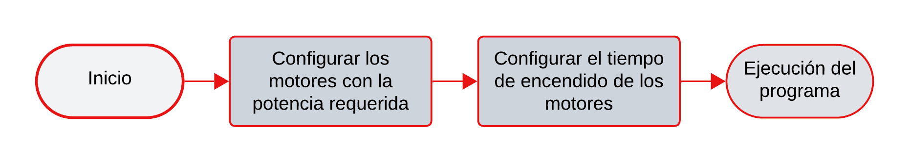
#### Moverse hacia adelante $8$ giros de la rueda
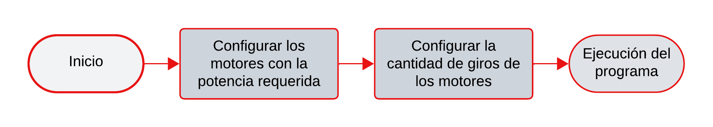
#### Moverse hacia adelante hasta $10 \ cm$ de un obstaculo
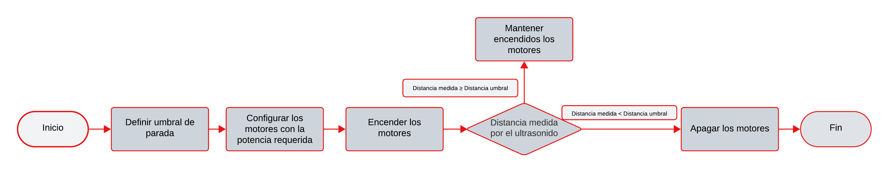

### Videos del robot ejecutando las actividades

#### Moverse Hacia adelante por 5 segundos 

https://github.com/user-attachments/assets/c212254d-742b-4f1e-96e7-f53bd0cdd79f

#### Moverse hacia adelante $8$ giros de la rueda

https://github.com/user-attachments/assets/c176052b-9167-4470-bec9-5a680a45fee8

#### Moverse hacia adelante hasta $10 \ cm$ de un obstaculo

https://github.com/user-attachments/assets/e5840739-04c0-4dcb-ba9e-d7545c7c81d0

### Codigo en blóques del software LEGO MINDSTORMS
#### Moverse hacia adelante $8$ giros de la rueda
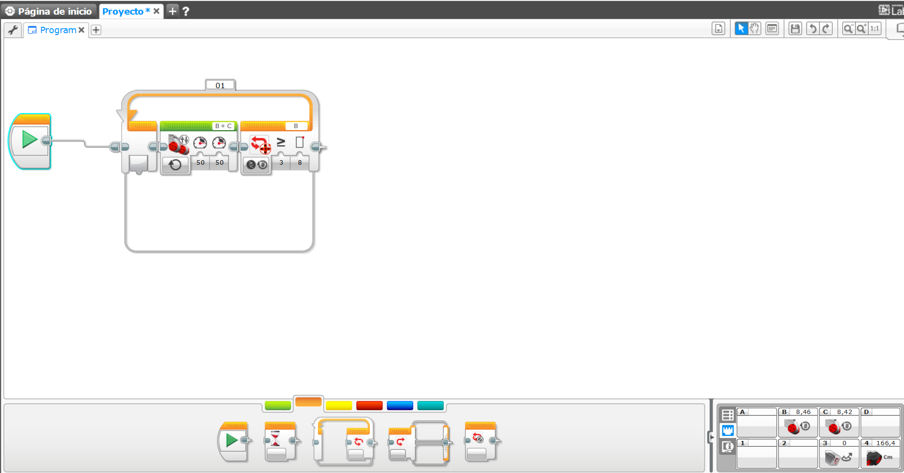
#### Moverse hacia adelante hasta $10 \ cm$ de un obstaculo
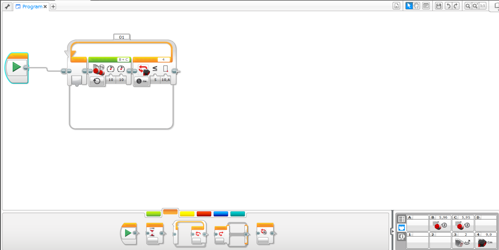

## Actividad 2
En esta actividad se programó el robot para describir trayectorias curvas controlando la diferencia de velocidades entre las ruedas. Primero,
se ejecutó un programa con una rueda a la mitad de la velocidad de la otra, se registró la trayectoria obtenida y se estimó de forma aproximada el
radio de giro. Luego, se diseñó un programa para replicar un radio de giro similar, pero realizando el giro en el sentido contrario (izquierda/derecha).

Adicionalmente, se realizaron pruebas variando la velocidad de la rueda más lenta a un cuarto y tres cuartos de la rueda más rápida, describiendo el efecto
de estos cambios sobre la curvatura y el radio de giro. Finalmente, se propuso un programa que combinara giros en sentidos opuestos para generar una trayectoria en forma de “S”.

### Solución planteada
Para generar la primera trayectoria curva, se configuró una rueda con potencia nominal y la otra al 50%. La trayectoria se registró en video y el radio de giro se estimó a partir de la relación entre las velocidades de las ruedas, calculando previamente la velocidad de la rueda más lenta como en la actividad anterior.

Asumiendo que la velocidad de la rueda exterior es el doble de la interior, se utilizó el modelo cinemático del vehículo diferencial:

$$R = \frac{L}{2} \frac{v_{ext}+v_{int}}{v_{ext}-v_{int}}$$

lo que, para $$v_{ext} =2 v_{int} $$, se simplifica a:

$$R=\frac{3L}{2} $$

Donde $$L$$ es la trocha del vehículo que es aroximadamente $$13 cm$$.

En el caso de la relación de velocidades de $$\frac{1}{4}$$ y $$\frac{3}{4}$$ , se observó que el radio de giro aumenta a medida que las velocidades de las ruedas se hacen más similares. Este comportamiento es consistente con el modelo cinemático del vehículo diferencial.

Aplicando la misma relación teórica utilizada anteriormente, se obtienen:

$$R_{1/4}=\frac{5L}{6}$$ $$R_{3/4}=\frac{7L}{2}$$

lo que confirma que, cuando la diferencia entre velocidades disminuye, el radio de giro se incrementa.

Para trazar la "S" con las ruedas, primero se realizo media curva, posteriormente se intercambiaron las velocidades de manera que realizara la misma curva pero en sentido contrario, en este caso, se utilizo potencia de 50 y 25, con un total de 4.2 revoluciones de las ruedas lo que nos dio media curva y la otra se consiguiio intercambiando las potencias manteniendo el numero de revoluciones.
 
### Diagrama de flujo de las acciones del robot

#### Mover una rueda a la mitad de la velocidad de la otra

#### Mover una rueda a un cuarto de la velocidad de la otra

#### Mover una rueda a tres cuartos de la velocidad de la otra

#### Generar una trayectoria en S

### Video del robot ejecutando la actividad

#### Una rueda a la mitad de la velocidad de la otra 

https://github.com/user-attachments/assets/95a9ee62-3a97-4095-a98a-614619e9f559

#### Una rueda un tercio de la velocidad de la otra 

https://github.com/user-attachments/assets/9605d587-1655-4afe-97b2-8b1c128cfaf1

#### Una rueda a tres cuartos de la velocidad de la otra

https://github.com/user-attachments/assets/a94747d1-72ac-4508-be0b-45fd8c2184b0

#### Trayectoria en S

https://github.com/user-attachments/assets/a54161ef-b4a6-4787-8392-959a6441fbfc

### Codigo en blóques del software LEGO MINDSTORMS

#### Codigo en bloques para la trayectoria en S

## Actividad 3
En esta actividad se estudió el funcionamiento del girosensor, analizando los valores que entrega en términos de ángulo de rotación y velocidad angular.
Se programó el robot para avanzar en línea recta, realizar un giro controlado de 45° utilizando la lectura del sensor y continuar con un segundo tramo en línea recta.

Posteriormente, se repitió el procedimiento programando un giro de 135°.

### Solución planteada
El girosensor del EV3 detecta la velocidad angular mediante un sistema interno basado en tecnología MEMS (Micro-Electro-Mechanical System), que mide variaciones en la orientación alrededor de un eje. A partir de esta señal, el sensor integra la velocidad angular para determinar el ángulo de giro acumulado, entregando resultados en grados y grados por segundo.

Para el programa de avance, giro y avance, se tomó inicialmente el número de vueltas de la actividad anterior para el primer desplazamiento en línea recta. Posteriormente, se programó el giro (45° y 135°), observándose que un valor positivo corresponde a un giro en sentido horario. Con el fin de mejorar la precisión de la medición angular, el giro se realizó a baja velocidad, permitiendo una lectura más estable del sensor. Finalmente, se programó un segundo desplazamiento rectilíneo de dos segundos en la nueva dirección obtenida tras el giro.

### Diagrama de flujo de las acciones del robot
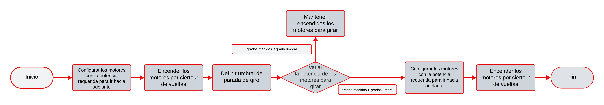
### Video del robot ejecutando la actividad

#### Robot girando 45° y continuando su camino 

https://github.com/user-attachments/assets/e334e458-a1c0-4513-934a-b25725400098

#### Robot girando 135° y continuando su camino

https://github.com/user-attachments/assets/58b109fe-0092-4f4a-9823-3941cd71feac

### Codigo en blóques del software LEGO MINDSTORMS
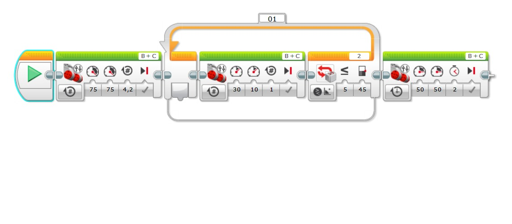

## Actividad 4
En esta actividad se programó el robot para avanzar en línea recta utilizando el sensor infrarrojo para detectar un obstáculo frontal. Al identificar la presencia del obstáculo,
el robot retrocede aproximadamente 10 cm, realiza un giro de 90° hacia la izquierda y continúa con un desplazamiento final en línea recta. Se cargó y ejecutó el programa en el EV3,
verificando el comportamiento esperado frente a la detección del objeto. Se observo que la potencia del motor al tener un valor bajo en un momento no logra mover el robot, sin embargo al giroscopio no detectar los 90°, continuo el movimiento hasta lograrlo.

### Solución planteada

Para esta actividad, se configuró un movimiento inicial con una potencia del **70%** en ambas ruedas. Aunque se trata de un valor relativamente alto, este nivel de accionamiento permite **reducir el efecto de las fricciones y no linealidades a bajas velocidades**, logrando un desplazamiento más cercano a una trayectoria rectilínea.

El sensor infrarrojo del EV3 proporciona una **medida relativa de proximidad** en una escala de **0 a 100**. En esta escala, un valor cercano a \(0\) indica que el obstáculo está **muy próximo**, mientras que un valor cercano a \(100\) indica que está **más alejado**. Esta lectura depende de la **radiación infrarroja reflejada** por el objeto.

En este experimento se estableció un umbral de proximidad de **40**. Para ello, se implementó un ciclo `while` que mantiene el movimiento del robot mientras la proximidad medida sea mayor que dicho umbral. El ciclo finaliza cuando:

$$
p_{\text{prox}} < 40
$$

donde $$\(p_{\text{prox}}\)$$ es la lectura de proximidad del sensor infrarrojo.

Posteriormente, el robot ejecuta un movimiento de retroceso con una potencia de \(-25\) en ambas ruedas durante una rotación de **191°**. Considerando un radio de rueda de r = 3cm, la distancia recorrida se estimó mediante la longitud de arco:

$$
s = r\theta
$$

con $$\theta$$ expresado en radianes:

$$
\theta = 191^\circ \cdot \frac{\pi}{180}
$$

Por tanto, la distancia recorrida es:

$$
s = 3 \cdot \left(191 \cdot \frac{\pi}{180}\right) \approx 10.0007\ \text{cm}
$$

Finalmente, se entra en un segundo ciclo `while`, en el cual el robot gira accionando una sola rueda con una potencia de **10**. Se utiliza una potencia baja para que tanto el sensor como el programa dispongan de más tiempo de muestreo, favoreciendo mediciones más precisas durante el giro. Este ciclo se mantiene hasta alcanzar una orientación de **90° hacia la izquierda**, es decir:

$$
\theta_{\text{giro}} = -90^\circ
$$

Una vez alcanzado este ángulo, el robot continúa en línea recta durante **2 segundos** con una potencia de **50** en ambas ruedas.

### Diagrama de flujo de las acciones del robot
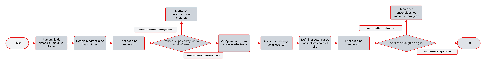
### Video del robot ejecutando la actividad

#### Robot se detiene al estar cerca al obstaculo, se regresa 10 cm, gira a la izquierda y continua su camino 

https://github.com/user-attachments/assets/7c3af644-980f-4c7b-8bfa-c67bda9159ea

### Codigo en blóques del software LEGO MINDSTORMS
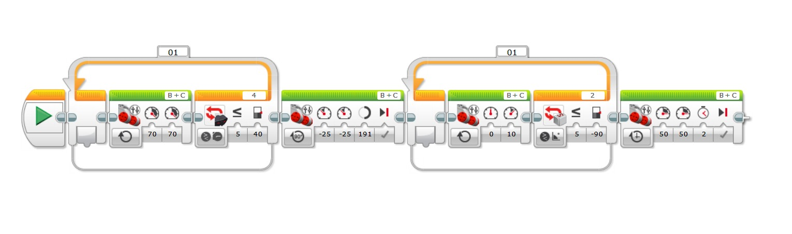

## Actividad 5
En esta actividad se programó el robot para ejecutar la misma secuencia de movimientos del ejercicio anterior, pero utilizando el sensor de contacto como mecanismo de detección.
El robot avanza en línea recta hasta que el sensor táctil es presionado por un obstáculo; en ese momento, retrocede aproximadamente 10 cm, realiza un giro de 90° hacia la izquierda
y continúa con un desplazamiento final en línea recta. El programa fue cargado y ejecutado en el EV3, verificando el funcionamiento del sensor como sistema de detección por contacto.

### Solución planteada
El procedimiento de esta actividad es equivalente al de la actividad anterior. En este caso, la única modificación se encuentra en el **primer ciclo `while`**, el cual ya no depende de la lectura del sensor infrarrojo, sino del **sensor de contacto**.

Para este sensor, el valor de lectura c toma el valor:

- c = 0: sensor no activado  
- c = 1: sensor activado (contacto detectado)

El ciclo `while` se mantiene mientras el sensor de contacto no esté activado, y finaliza cuando se detecta contacto, es decir, cuando:

$$
c = 1
$$

### Diagrama de flujo de las acciones del robot
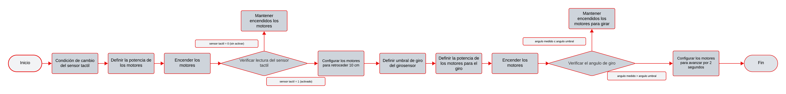      
### Video del robot ejecutando la actividad

#### Robot se regresa 10 cm luego de que el sensor de contacto toca la superficie, gira a la izquierda y continua su camino.
 

https://github.com/user-attachments/assets/e6328f4d-175e-4917-9319-8f3dd87e1b6b

### Codigo en blóques del software LEGO MINDSTORMS
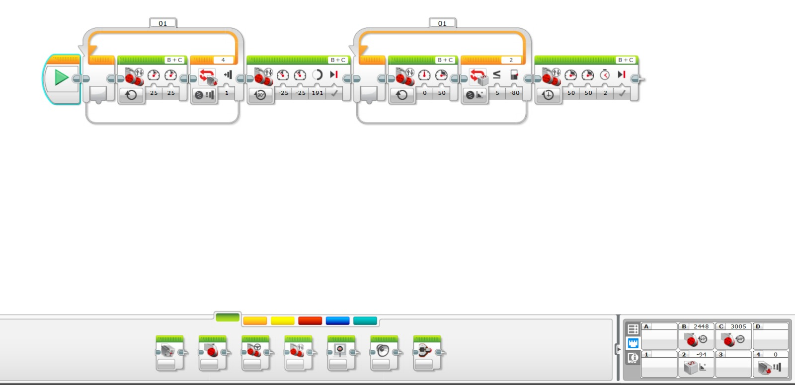
