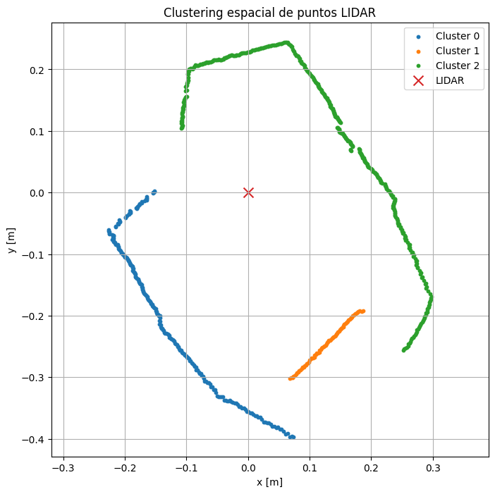

# Lab 4 FMR: Sensores con ROS
## Grupo de trabajo 2
Johan Sebastian Suarez Sepulveda\
Santiago Calderón Alarcón\
Mateo Concha Buitrago

## Actividad 1
El objetivo de esta actividad fue implementar la conexión de un sensor externo a ROS mediante una tarjeta de desarrollo Arduino. Para ello, se implementó un programa en Arduino para adquirir la velocidad angular del eje z desde el sensor MPU6050 integrado en el módulo GY-87. La comunicación con el sensor se realizó mediante protocolo I2C, utilizando la librería Wire.h y la dirección 0x68. Durante la inicialización, se escribió el valor 0x00 en el registro 0x6B para sacar al sensor del modo de suspensión. Posteriormente, en cada iteración del ciclo principal, se leyeron los dos bytes correspondientes al registro GYRO_ZOUT_H, reconstruyendo así la medición cruda de 16 bits del giroscopio en z. Esta señal se convirtió primero a grados por segundo usando la sensibilidad por defecto del MPU6050 (131 LSB/(∘/s)), y luego a radianes por segundo para adecuarla al formato utilizado en ROS. Finalmente, el dato se publicó en el tópico /gz mediante rosserial, usando un mensaje de tipo std_msgs/Float32 con una frecuencia aproximada de 20 Hz.

Debido a que el sensor seleccionado fue una Unidad de Medición Inercial (IMU), el patrón de comparación correspondió a los valores de velocidad angular proporcionados por la IMU integrada del robot Kobuki. Estos valores fueron obtenidos durante la ejecución de movimientos programados en el robot, con el fin de contrastar las mediciones del sensor externo frente a una referencia conocida.

### Solución planteada
Para la integración del sensor externo se utilizó una Unidad de Medición Inercial MPU6050 conectada a una tarjeta Arduino mediante comunicación I2C. El código implementado en la tarjeta permitió inicializar la comunicación con el sensor, configurar su dirección de operación y leer los registros correspondientes al acelerómetro y giroscopio.

Posteriormente, los datos crudos obtenidos desde el sensor fueron convertidos a unidades físicas. En este caso para que las medidas de la IMU MPU6050 y la del kobuki tuvieran las mismas unidades se pasaron a radianes por segundo.

Para establecer la comunicación entre Arduino y ROS se utilizó la librería `rosserial`, la cual permitió conectar la tarjeta de desarrollo con el ecosistema ROS mediante el puerto serial. De esta manera, la información adquirida por la IMU pudo ser enviada desde Arduino hacia el computador y publicada en un tópico de ROS. En este caso, el patrón utilizado correspondió a los valores de velocidad angular obtenidos por la IMU integrada del robot Kobuki.

La prueba fue muy sencilla se utilizo el topico del kobuki `/mobile_base/commands/velocity`, en el se publico el siguiente mensaje : 

`rostopic pub -r 10 /mobile_base/commands/velocity geometry_msgs/Twist \
'{linear: {x: 0.0, y: 0.0, z: 0.0}, angular: {x: 0.0, y: 0.0, z: 0.4}}'`

Esto generaba una velocidad angular de 0.4 radianes por segundo, con el comando 

`rostopic echo /mobile_base/sensors/imu_data/angular_velocity/z`

Se obtuvo la velocidad angular con la imu del kobuki y con el comando: 

`rostopic echo /gz`

Se obtuvo la velocidad angular con la imu conectada a arduino.

#### Resultados obtenidos

El terminal que mostraba los datos obtenidos por la imu de arduino eran los siguientes:


Los resultads obtenidos por el kobuki nos daba un valor muy cercano a 0.4 rad/s, mientras que los tomados por la imu tenian una variacion entre 0.38 y 0.43 demostrando las diferencias entre los sensores, estas pueden ser debidas a que el sensor estaba sobre una protoboard encima del robot, el cual como se ve en el video no tenia un movimiento constante sino que tenia ciertas iercias al arranque de las ruedas lo que derivo en errores en la imu conectada al arduino sin embargo el objetivo de realizar la conexion de sensores mediante arduino se logro satisfactoriamente.


##### Código Arduino - Lectura de IMU MPU6050
```cpp
#include <Wire.h>
#include <ros.h>
#include <std_msgs/Float32.h>

const uint8_t MPU_ADDR = 0x68;

// Al menos 1 subscriber y 1 publisher
typedef ros::NodeHandle_<ArduinoHardware, 1, 1, 96, 96> NodeHandle;
NodeHandle nh;

std_msgs::Float32 gz_msg;
ros::Publisher pub_gz("gz", &gz_msg);

void writeRegister(uint8_t reg, uint8_t value) {
  Wire.beginTransmission(MPU_ADDR);
  Wire.write(reg);
  Wire.write(value);
  Wire.endTransmission();
}

bool readGyroZ(float &gz_rad_s) {
  Wire.beginTransmission(MPU_ADDR);
  Wire.write(0x47);   // GYRO_ZOUT_H
  if (Wire.endTransmission(false) != 0) return false;

  Wire.requestFrom(MPU_ADDR, (uint8_t)2);
  if (Wire.available() < 2) return false;

  int16_t raw = (Wire.read() << 8) | Wire.read();

  float gz_deg_s = raw / 131.0;          // ±250 deg/s
  gz_rad_s = gz_deg_s * PI / 180.0;      // rad/s
  return true;
}

void setup() {
  Wire.begin();

  // Despertar MPU6050
  writeRegister(0x6B, 0x00);

  nh.getHardware()->setBaud(57600);
  nh.initNode();
  nh.advertise(pub_gz);
}

void loop() {
  float gz;
  if (readGyroZ(gz)) {
    gz_msg.data = gz;
    pub_gz.publish(&gz_msg);
  }

  nh.spinOnce();
  delay(50);   // ~20 Hz
}

```
##### Viedo con el Kobuki

https://github.com/user-attachments/assets/e7307927-239c-469a-bf8c-8f208bb38310


## Actividad 2
En esta actividad se integró una cámara web al workspace de ROS siguiendo el procedimiento descrito en la guía suministrada. Una vez configurado el dispositivo, se verificó su funcionamiento mediante la herramienta `rqt`, permitiendo visualizar la imagen capturada y validar su correcta incorporación al ecosistema ROS.

### Solución planteada

Para la implementación de la cámara web se utilizó el tópico `/usb_cam/image_raw`, el cual permitió recibir la información visual capturada por el dispositivo. A partir de este tópico, se desarrolló un nodo en Python llamado `image_detector.py`, encargado de suscribirse a la imagen publicada por la cámara y procesarla mediante OpenCV.

El nodo empleó la librería `cv_bridge` para convertir los mensajes de imagen de ROS al formato compatible con OpenCV.

El nodo se inicializó de la siguiente manera:

```python
rospy.init_node('image_detector', anonymous=True)
self.bridge = CvBridge()
rospy.Subscriber("/usb_cam/image_raw", Image, self.callback)
```

#### Análisis de Mensajes

El tópico utilizado para recibir la información de la cámara fue `/usb_cam/image_raw`. Este tópico publica mensajes de tipo `sensor_msgs/Image`, los cuales contienen la información visual capturada por la cámara web.

```python
from sensor_msgs.msg import Image
```

El nodo se suscribió al tópico de imagen mediante la siguiente instrucción:

```python
rospy.Subscriber("/usb_cam/image_raw", Image, self.callback)
```

Cada vez que se recibe un mensaje, este es procesado dentro de la función `callback()`. Debido a que ROS maneja la imagen como un mensaje de tipo `sensor_msgs/Image`, fue necesario convertirlo a un formato compatible con OpenCV mediante `cv_bridge`:

```python
frame = self.bridge.imgmsg_to_cv2(msg, desired_encoding='bgr8')
```

Una vez realizada la conversión, la imagen fue transformada a escala de grises y posteriormente segmentada mediante un umbral. Esto permitió identificar los contornos presentes en la imagen:

```python
gray = cv2.cvtColor(frame, cv2.COLOR_BGR2GRAY)
_, thresh = cv2.threshold(gray, 100, 255, cv2.THRESH_BINARY)
contours, _ = cv2.findContours(thresh, cv2.RETR_TREE, cv2.CHAIN_APPROX_SIMPLE)
```

Luego, los contornos detectados fueron dibujados sobre la imagen original para facilitar su visualización:

```python
frame_contours = frame.copy()
cv2.drawContours(frame_contours, contours, -1, (0, 255, 0), 2)
```

Adicionalmente, se implementó un sustractor de fondo para detectar movimiento en la escena. Esta herramienta permitió generar una máscara que resalta los cambios entre cuadros consecutivos:

```python
self.back_sub = cv2.createBackgroundSubtractorMOG2(
    history=100,
    varThreshold=50,
    detectShadows=True
)
```

La máscara de movimiento fue procesada mediante una operación morfológica de apertura, con el fin de reducir ruido en la imagen:

```python
fg_mask = self.back_sub.apply(frame)
kernel = cv2.getStructuringElement(cv2.MORPH_ELLIPSE, (5, 5))
fg_mask = cv2.morphologyEx(fg_mask, cv2.MORPH_OPEN, kernel)
```

Finalmente, los resultados fueron visualizados mediante ventanas de OpenCV:

```python
cv2.imshow("Contornos en Imagen", frame_contours)
cv2.imshow("Máscara de Movimiento", fg_mask)
cv2.waitKey(1)
```

#### Resultados obtenidos

##### Codígo

```python
#!/usr/bin/env python3

import rospy
from sensor_msgs.msg import Image
from cv_bridge import CvBridge
import cv2

class ImageDetector:
    def __init__(self):
        rospy.init_node('image_detector', anonymous=True)
        self.bridge = CvBridge()
        rospy.Subscriber("/usb_cam/image_raw", Image, self.callback)

        # Sustractor de fondo para detectar movimiento
        self.back_sub = cv2.createBackgroundSubtractorMOG2(
            history=100,
            varThreshold=50,
            detectShadows=True
        )

        rospy.loginfo("Nodo de detección de imagen con contornos y movimiento iniciado.")
        rospy.spin()

    def callback(self, msg):
        try:
            # Convertir mensaje a imagen OpenCV
            frame = self.bridge.imgmsg_to_cv2(msg, desired_encoding='bgr8')

            # Detección de contornos en escala de grises
            gray = cv2.cvtColor(frame, cv2.COLOR_BGR2GRAY)
            _, thresh = cv2.threshold(gray, 100, 255, cv2.THRESH_BINARY)
            contours, _ = cv2.findContours(
                thresh,
                cv2.RETR_TREE,
                cv2.CHAIN_APPROX_SIMPLE
            )

            # Dibujar contornos sobre la imagen original
            frame_contours = frame.copy()
            cv2.drawContours(frame_contours, contours, -1, (0, 255, 0), 2)

            # Generar máscara de movimiento
            fg_mask = self.back_sub.apply(frame)
            kernel = cv2.getStructuringElement(cv2.MORPH_ELLIPSE, (5, 5))
            fg_mask = cv2.morphologyEx(fg_mask, cv2.MORPH_OPEN, kernel)

            # Mostrar resultados
            cv2.imshow("Contornos en Imagen", frame_contours)
            cv2.imshow("Máscara de Movimiento", fg_mask)
            cv2.waitKey(1)

        except Exception as e:
            rospy.logerr("Error procesando la imagen: %s", str(e))

if __name__ == "__main__":
    try:
        ImageDetector()
    except rospy.ROSInterruptException:
        pass
```
##### Captura de pantalla con la imagen de la cámara


## Actividad 3
El objetivo de esta actividad fue realizar el reconocimiento y la adquisición de datos del sensor RPLIDAR C1 mediante el paquete `rplidar_ros`. Para ello, se descargó y configuró la librería correspondiente en el workspace de ROS y posteriormente se ejecutó el nodo del sensor mediante el comando `roslaunch rplidar_ros rplidar_c1.launch`.

Una vez iniciado el nodo, se verificó el reconocimiento del dispositivo, la publicación de los tópicos asociados y la información suministrada por el sensor. Además, se revisó el tipo de mensaje generado, con el fin de identificar la estructura de los datos entregados por el RPLIDAR para su posterior procesamiento.

### Solución planteada

Para el sensor **RPLIDAR C1**, el paquete `rplidar_ros` puede ejecutarse con alguno de los siguientes comandos:

```bash
roslaunch rplidar_ros rplidar_c1.launch
```

o, si se desea visualizar la información en RViz:

```bash
roslaunch rplidar_ros view_rplidar_c1.launch
```

## 1. Nodos involucrados

El paquete `rplidar_ros` incluye principalmente los siguientes ejecutables:

- `rplidarNode`
- `rplidarNodeClient`

### Descripción

- `rplidarNode`: nodo principal encargado de adquirir y publicar la información del sensor.
- `rplidarNodeClient`: aplicación cliente de prueba para visualizar resultados en consola.

---

## 2. Tópico principal del sensor

### `/scan`

- **Tipo de mensaje:** `sensor_msgs/LaserScan`
- **Descripción:** contiene el barrido láser bidimensional del entorno generado por el RPLIDAR. En este tópico se publican las distancias medidas para diferentes direcciones angulares durante cada escaneo.

---

## 3. Información contenida en el mensaje `sensor_msgs/LaserScan`

El mensaje `sensor_msgs/LaserScan` contiene, entre otros, los siguientes campos:

- `header`: cabecera del mensaje, incluye el tiempo de publicación y el marco de referencia.
- `angle_min`: ángulo inicial del escaneo en radianes.
- `angle_max`: ángulo final del escaneo en radianes.
- `angle_increment`: separación angular entre muestras consecutivas.
- `time_increment`: tiempo entre mediciones consecutivas.
- `scan_time`: tiempo total de un barrido completo.
- `range_min`: distancia mínima válida.
- `range_max`: distancia máxima válida.
- `ranges`: arreglo con las distancias medidas.
- `intensities`: arreglo con intensidades de retorno, cuando el sensor las proporciona.

---

## 4. Interpretación del tópico `/scan`

La información publicada en `/scan` representa una nube angular de distancias en un plano 2D. Este tópico puede utilizarse posteriormente para tareas como:

- detección de obstáculos,
- navegación móvil,
- localización,
- construcción de mapas 2D,
- algoritmos SLAM.
---

#### Resultados obtenidos

al abrir el visualizador rviz estos son los datos suministrados por el lidar. 


## Actividad 4
Una vez completada la configuración del RPLIDAR C1, se construyó un laberinto como entorno controlado para contrastar las mediciones generadas por el sensor con las dimensiones reales del escenario. Para ello, se ubicó un elemento de referencia dentro del laberinto, se extrajeron los datos crudos del LIDAR y se transformaron a coordenadas cartesianas para su posterior análisis y comparación con las medidas reales.

### Solución planteada

En esta actividad se utilizó el sensor RPLIDAR C1 dentro de un laberinto construido. El objetivo fue capturar las mediciones generadas por el sensor, representar el entorno detectado y contrastar dichas mediciones con una tabla de medidas conocidas del escenario.

La solución consistió en implementar un nodo en Python llamado `lidar_cartesian_plot.py`, el cual se suscribe al tópico `/scan` publicado por el RPLIDAR. A partir de este tópico se obtienen los datos crudos del escáner, expresados como distancias y ángulos. Posteriormente, estos datos son filtrados para conservar únicamente las mediciones válidas y se transforman de coordenadas polares a coordenadas cartesianas.

La transformación utilizada fue:

```math
x = r \cos(\theta)
```

```math
y = r \sin(\theta)
```

donde `r` corresponde a la distancia medida por el LIDAR y `θ` al ángulo asociado a cada lectura. Esta conversión permitió representar los puntos detectados por el sensor en un plano cartesiano.

Adicionalmente, los puntos transformados fueron guardados en formato `.csv`, lo cual permitió realizar un análisis posterior de las mediciones. A partir de estos datos se aplicó un agrupamiento espacial para identificar el elemento de referencia dentro del laberinto y estimar su longitud, comparando posteriormente el valor obtenido con la medida real registrada en la tabla del entorno.

#### Análisis de Mensajes

El nodo implementado se suscribe al tópico `/scan`, el cual publica mensajes de tipo `sensor_msgs/LaserScan`. Este tipo de mensaje contiene la información necesaria para describir un barrido del LIDAR, incluyendo las distancias medidas, el ángulo inicial, el incremento angular entre mediciones y los rangos mínimo y máximo válidos del sensor.

```python
from sensor_msgs.msg import LaserScan
```

La suscripción al tópico se realizó mediante la siguiente instrucción:

```python
rospy.Subscriber('/scan', LaserScan, callback)
```

Dentro de la función `callback()`, se extrajeron las distancias medidas por el LIDAR mediante el campo `ranges` del mensaje:

```python
ranges = np.array(msg.ranges, dtype=np.float64)
```

Posteriormente, se calcularon los ángulos correspondientes a cada medición usando `angle_min` y `angle_increment`:

```python
angles = msg.angle_min + np.arange(len(ranges)) * msg.angle_increment
```

Antes de transformar los datos, se aplicó un filtro para conservar únicamente las mediciones válidas. Para ello, se verificó que las distancias fueran finitas y que estuvieran dentro del rango mínimo y máximo permitido por el sensor:

```python
valid = np.isfinite(ranges)
valid &= (ranges >= msg.range_min)
valid &= (ranges <= msg.range_max)
```

Finalmente, las mediciones válidas fueron transformadas a coordenadas cartesianas:

```python
x_data = ranges * np.cos(angles)
y_data = ranges * np.sin(angles)
```

#### Resultados obtenidos

##### Código fuente

```python
#!/usr/bin/env python3

import rospy
from sensor_msgs.msg import LaserScan
import numpy as np
import matplotlib.pyplot as plt
import os
from datetime import datetime

x_data = np.array([])
y_data = np.array([])

def callback(msg):
    global x_data, y_data

    ranges = np.array(msg.ranges, dtype=np.float64)
    angles = msg.angle_min + np.arange(len(ranges)) * msg.angle_increment

    valid = np.isfinite(ranges)
    valid &= (ranges >= msg.range_min)
    valid &= (ranges <= msg.range_max)

    ranges = ranges[valid]
    angles = angles[valid]

    x_data = ranges * np.cos(angles)
    y_data = ranges * np.sin(angles)

def save_points():
    global x_data, y_data

    if len(x_data) == 0:
        rospy.logwarn("No hay puntos para guardar.")
        return

    save_dir = os.path.expanduser("~/catkin_ws/src/lidar_processing/data")
    os.makedirs(save_dir, exist_ok=True)

    timestamp = datetime.now().strftime("%Y%m%d_%H%M%S")
    filename = os.path.join(save_dir, f"scan_points_{timestamp}.csv")

    points = np.column_stack((x_data, y_data))
    np.savetxt(filename, points, delimiter=",", header="x,y", comments="")

    rospy.loginfo("Puntos guardados en: %s", filename)
    print(f"\nPuntos guardados en: {filename}")

def on_key(event):
    if event.key == 'g':
        save_points()

def main():
    global x_data, y_data

    rospy.init_node('lidar_join_points_save')
    rospy.Subscriber('/scan', LaserScan, callback)

    plt.ion()
    fig, ax = plt.subplots(figsize=(8, 8))
    fig.canvas.mpl_connect('key_press_event', on_key)

    print("\nPresiona 'g' sobre la ventana de la gráfica para guardar los puntos actuales en CSV.\n")

    rate = rospy.Rate(10)
    while not rospy.is_shutdown():
        ax.clear()

        if len(x_data) > 0:
            ax.scatter(x_data, y_data, s=10)
            ax.plot(x_data, y_data, linewidth=1.5)

        ax.scatter([0], [0], s=80, marker='x')
        ax.set_title("LIDAR uniendo puntos  |  Presiona 'g' para guardar CSV")
        ax.set_xlabel("x [m]")
        ax.set_ylabel("y [m]")
        ax.axis('equal')
        ax.grid(True)
        ax.set_xlim(-1.5, 1.5)
        ax.set_ylim(-1.5, 1.5)

        plt.pause(0.01)
        rate.sleep()

    plt.close('all')

if __name__ == '__main__':
    try:
        main()
    except rospy.ROSInterruptException:
        pass
```
##### Grafico obtenido y comparación de distancia



Los tramos obtenidos a partir de los datos del LIDAR fueron agrupados mediante un proceso de **geo-clustering**, con el fin de identificar el segmento correspondiente al elemento de referencia dentro del entorno. Posteriormente, la longitud estimada por el sensor fue comparada con la medida tomada manualmente en el laboratorio.

La medida real registrada con metro fue de **16,5 cm**, mientras que la medida obtenida a partir del sensor fue de **16,12 cm**. Esto representa una diferencia de **0,38 cm** y un error porcentual aproximado de **2,30 %**.

```math
Error\ porcentual = \frac{|16.5 - 16.12|}{16.5} \times 100 = 2.30\%
```

## Actividad 5
Una vez completada la configuración del RPLIDAR C1 y realizada la investigación sobre el paquete `hector_slam`, se construyó un nuevo laberinto para implementar el proceso de mapeo del entorno en ROS. Esta actividad permitió analizar el funcionamiento del paquete, su uso de la información del LIDAR y la generación de un mapa del escenario de prueba.

### Solución planteada

### Solución planteada

Para esta actividad se utilizó el paquete `hector_slam`, específicamente el nodo `hector_mapping`, con el propósito de generar un mapa del laberinto construido a partir de la información suministrada por el RPLIDAR C1.

La solución consistió en configurar un archivo tipo `launch` llamado `mapping_default.launch`, encargado de iniciar el nodo de mapeo y definir los parámetros necesarios para la generación del mapa. Este nodo recibe la información del sensor LIDAR a través del tópico `/scan`, el cual contiene los datos del barrido láser del entorno.

A diferencia de otros métodos de SLAM que requieren información de odometría, `hector_slam` puede estimar el movimiento del robot principalmente a partir de las lecturas del LIDAR. Por esta razón, en la configuración utilizada se definieron los marcos de referencia `base_frame` y `odom_frame` como `laser`, permitiendo trabajar directamente con la información del sensor.

```xml
<arg name="base_frame" default="laser"/>
<arg name="odom_frame" default="laser"/>
<arg name="scan_topic" default="scan"/>
```

El nodo principal se ejecutó mediante la siguiente configuración:

```xml
<node pkg="hector_mapping" type="hector_mapping" name="hector_mapping" output="screen">
```

#### Análisis de Mensajes
#### Resultados obtenidos
#### Código fuente
