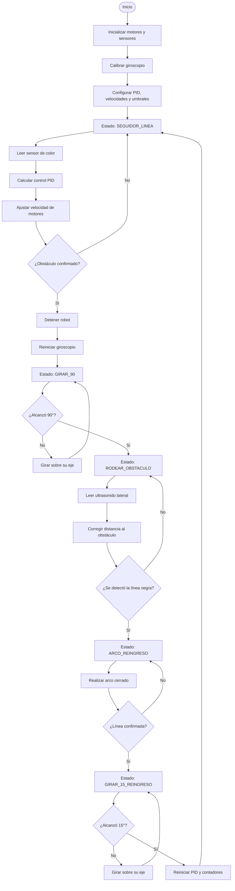
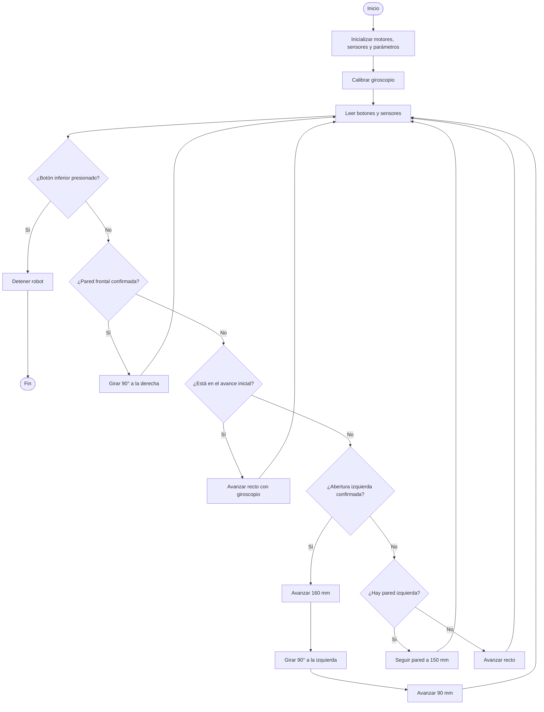

# Lab 5 FMR: Navegación basada en comportamientos
## Grupo de trabajo 2
Johan Sebastian Suarez Sepulveda\
Santiago Calderón Alarcón\
Mateo Concha Buitrago

## Código 1: BUG
### Descripción del Código
El programa controla el robot LEGO que sigue la cinta negra y evita obstáculos mediante una estrategia de navegación por estados. Para ello se utilizó un sensor de color, un sensor infrarrojo frontal, un sensor ultrasónico lateral y un giroscopio.

El funcionamiento principal se divide en cinco estados:

1. Seguidor de línea: El robot utiliza un controlador PID para mantener el sensor de color sobre el borde de la línea negra. La velocidad de cada motor se ajusta a partir del error entre la reflexión medida y el valor objetivo.

2. Giro de 90°: Cuando el sensor infrarrojo confirma un obstáculo frontal, el robot se detiene y realiza un giro de 90° utilizando el giroscopio.

3. Rodeo del obstáculo: Después del giro, el robot utiliza el sensor ultrasónico lateral derecho para mantener una distancia aproximada de 100 mm respecto al obstáculo mientras lo bordea.

4. Arco de reingreso: Cuando el sensor de color vuelve a detectar la línea negra, el robot realiza una curva cerrada para acercarse nuevamente a la trayectoria.

5. Giro de reingreso: Finalmente, ejecuta un giro adicional de 15° y reinicia el controlador PID antes de volver al seguimiento normal de la línea.

Las detecciones del obstáculo y de la línea deben repetirse durante varios ciclos para evitar decisiones provocadas por ruido en los sensores.

### Diagrama de flujo


### Código

```python
#!/usr/bin/env pybricks-micropython

from pybricks.hubs import EV3Brick
from pybricks.ev3devices import Motor, ColorSensor, GyroSensor
from pybricks.ev3devices import InfraredSensor, UltrasonicSensor
from pybricks.parameters import Port, Stop
from pybricks.tools import wait, StopWatch

ev3 = EV3Brick()

motor_izq = Motor(Port.A)
motor_der = Motor(Port.B)

sensor_ir = InfraredSensor(Port.S1)
sensor_gyro = GyroSensor(Port.S2)
sensor_ultra = UltrasonicSensor(Port.S3)
sensor_color = ColorSensor(Port.S4)

Ts = 10
Ts_s = Ts / 1000

sentido_motores = 1

ev3.speaker.beep()

print("Calibrando giroscopio...")
print("No mover el robot")

wait(1000)
sensor_gyro.reset_angle(0)
wait(500)

print("Giroscopio calibrado")

valor_negro = 3
valor_blanco = 11

objetivo = (valor_negro + valor_blanco) / 2
umbral_linea = 5

velocidad_base = 180

Kp = 25.0
Ki = 0.02
Kd = 3.0

error_anterior = 0
integral = 0

integral_min = -200
integral_max = 200

reloj = StopWatch()
tiempo_anterior = reloj.time()

umbral_ir = 10
conteo_ir = 0
conteo_ir_necesario = 3

angulo_giro = 90
velocidad_giro = 120
sentido_giro = -1

distancia_objetivo = 100

velocidad_rodeo = 130
Kp_ultra = 0.45

correccion_ultra_max = 45

velocidad_rodeo_min = 80
velocidad_rodeo_max = 220

tiempo_ignorar_linea = 1500

conteo_linea = 0
conteo_linea_necesario = 4

velocidad_arco_lenta = 70
velocidad_arco_rapida = 210

tiempo_arco_min = 700
sentido_arco = 1
tiempo_inicio_arco = 0

angulo_giro_reingreso = 15
velocidad_giro_reingreso = 100
sentido_giro_reingreso = 1

SEGUIDOR_LINEA = 0
GIRAR_90 = 1
RODEAR_OBSTACULO = 2
ARCO_REINGRESO = 3
GIRAR_15_REINGRESO = 4
STOPPED = 5

estado = SEGUIDOR_LINEA
tiempo_inicio_rodeo = 0

ev3.speaker.beep()

print("Robot Bug iniciado")
print("Estado inicial: SEGUIDOR_LINEA")
print("S1: infrarrojo frontal")
print("S2: giroscopio")
print("S3: ultrasonido lateral derecho")
print("S4: color")
print("Negro:", valor_negro)
print("Blanco:", valor_blanco)
print("Objetivo PID:", objetivo)
print("Distancia ultrasonido:", distancia_objetivo, "mm")
print("Giro de reingreso:", angulo_giro_reingreso, "grados")


def limitar(valor, minimo, maximo):
    if valor > maximo:
        return maximo

    if valor < minimo:
        return minimo

    return valor


def detener_robot():
    motor_izq.stop(Stop.BRAKE)
    motor_der.stop(Stop.BRAKE)


def reiniciar_pid():
    global error_anterior
    global integral
    global tiempo_anterior

    error_anterior = 0
    integral = 0
    tiempo_anterior = reloj.time()


def seguir_linea_pid():
    global error_anterior
    global integral
    global tiempo_anterior

    luz = sensor_color.reflection()

    tiempo_actual = reloj.time()
    dt = (tiempo_actual - tiempo_anterior) / 1000

    if dt <= 0:
        dt = Ts_s

    error = objetivo - luz

    integral += error * dt
    integral = limitar(integral, integral_min, integral_max)

    derivada = (error - error_anterior) / dt

    correccion = Kp * error + Ki * integral + Kd * derivada

    velocidad_izq = velocidad_base - correccion
    velocidad_der = velocidad_base + correccion

    velocidad_izq = limitar(velocidad_izq, -800, 800)
    velocidad_der = limitar(velocidad_der, -800, 800)

    motor_izq.run(sentido_motores * velocidad_izq)
    motor_der.run(sentido_motores * velocidad_der)

    error_anterior = error
    tiempo_anterior = tiempo_actual

    return luz


def obstaculo_confirmado():
    global conteo_ir

    distancia_ir = sensor_ir.distance()

    if distancia_ir <= umbral_ir:
        conteo_ir += 1
    else:
        conteo_ir = 0

    if conteo_ir >= conteo_ir_necesario:
        conteo_ir = 0

        print("Obstaculo detectado. IR:", distancia_ir)

        return True

    return False


def iniciar_giro_90():
    detener_robot()
    wait(100)

    sensor_gyro.reset_angle(0)
    wait(100)

    print("Iniciando giro de 90 grados")


def ejecutar_giro_90():
    angulo_leido = sensor_gyro.angle()
    angulo_actual = abs(angulo_leido)

    if angulo_actual >= angulo_giro:
        detener_robot()
        wait(100)

        print("Giro de 90 terminado")
        print("Angulo final:", sensor_gyro.angle(), "deg")

        return True

    error_giro = angulo_giro - angulo_actual

    if error_giro < 20:
        velocidad = 70
    else:
        velocidad = velocidad_giro

    motor_izq.run(sentido_motores * sentido_giro * velocidad)
    motor_der.run(sentido_motores * -sentido_giro * velocidad)

    return False


def rodear_obstaculo_derecha():
    distancia = sensor_ultra.distance()

    if distancia > 500:
        distancia = 500

    error_ultra = distancia - distancia_objetivo

    correccion = Kp_ultra * error_ultra
    correccion = limitar(
        correccion,
        -correccion_ultra_max,
        correccion_ultra_max
    )

    velocidad_izq = velocidad_rodeo + correccion
    velocidad_der = velocidad_rodeo - correccion

    velocidad_izq = limitar(
        velocidad_izq,
        velocidad_rodeo_min,
        velocidad_rodeo_max
    )

    velocidad_der = limitar(
        velocidad_der,
        velocidad_rodeo_min,
        velocidad_rodeo_max
    )

    motor_izq.run(sentido_motores * velocidad_izq)
    motor_der.run(sentido_motores * velocidad_der)

    return distancia


def linea_confirmada():
    global conteo_linea

    luz = sensor_color.reflection()

    if luz < umbral_linea:
        conteo_linea += 1
    else:
        conteo_linea = 0

    if conteo_linea >= conteo_linea_necesario:
        conteo_linea = 0

        print("Linea negra encontrada. Luz:", luz)

        return True

    return False


def iniciar_arco_reingreso():
    global tiempo_inicio_arco
    global conteo_linea

    tiempo_inicio_arco = reloj.time()
    conteo_linea = 0

    print("Iniciando arco de reingreso con radio pequeno")


def ejecutar_arco_reingreso():
    tiempo_actual = reloj.time()
    tiempo_arco = tiempo_actual - tiempo_inicio_arco

    if sentido_arco == 1:
        velocidad_izq = velocidad_arco_lenta
        velocidad_der = velocidad_arco_rapida
    else:
        velocidad_izq = velocidad_arco_rapida
        velocidad_der = velocidad_arco_lenta

    motor_izq.run(sentido_motores * velocidad_izq)
    motor_der.run(sentido_motores * velocidad_der)

    if tiempo_arco > tiempo_arco_min and linea_confirmada():
        detener_robot()
        wait(100)

        print("Linea detectada durante arco")

        return True

    return False


def iniciar_giro_15_reingreso():
    detener_robot()
    wait(100)

    sensor_gyro.reset_angle(0)
    wait(100)

    print("Iniciando giro puro de 15 grados")


def ejecutar_giro_15_reingreso():
    angulo_leido = sensor_gyro.angle()
    angulo_actual = abs(angulo_leido)

    if angulo_actual >= angulo_giro_reingreso:
        detener_robot()
        wait(100)

        print("Giro de 15 terminado")
        print("Angulo final:", sensor_gyro.angle(), "deg")

        return True

    error_giro = angulo_giro_reingreso - angulo_actual

    if error_giro < 8:
        velocidad = 50
    else:
        velocidad = velocidad_giro_reingreso

    motor_izq.run(
        sentido_motores
        * sentido_giro_reingreso
        * velocidad
    )

    motor_der.run(
        sentido_motores
        * -sentido_giro_reingreso
        * velocidad
    )

    return False


while True:
    if estado == SEGUIDOR_LINEA:
        seguir_linea_pid()

        if obstaculo_confirmado():
            iniciar_giro_90()
            estado = GIRAR_90

    elif estado == GIRAR_90:
        if ejecutar_giro_90():
            tiempo_inicio_rodeo = reloj.time()
            conteo_linea = 0

            print("Entrando a RODEAR_OBSTACULO")

            estado = RODEAR_OBSTACULO

    elif estado == RODEAR_OBSTACULO:
        distancia = rodear_obstaculo_derecha()

        tiempo_actual = reloj.time()
        tiempo_rodeando = tiempo_actual - tiempo_inicio_rodeo

        if tiempo_rodeando > tiempo_ignorar_linea:
            if linea_confirmada():
                print("Linea encontrada despues del obstaculo")
                print("Distancia ultrasonido:", distancia, "mm")

                iniciar_arco_reingreso()
                estado = ARCO_REINGRESO

    elif estado == ARCO_REINGRESO:
        if ejecutar_arco_reingreso():
            iniciar_giro_15_reingreso()
            estado = GIRAR_15_REINGRESO

    elif estado == GIRAR_15_REINGRESO:
        if ejecutar_giro_15_reingreso():
            reiniciar_pid()

            conteo_ir = 0
            conteo_linea = 0

            print("Volviendo a SEGUIDOR_LINEA")

            estado = SEGUIDOR_LINEA

    elif estado == STOPPED:
        detener_robot()
        ev3.speaker.beep()
        break

    wait(Ts)

```

### Video de funcionamiento


## Código 2: MAZE
### Descripción del Código
El programa controla el robot LEGO para recorrer un laberinto siguiendo la **pared izquierda**. Para ello se utilizó un sensor ultrasónico frontal para detectar obstáculos, un giroscopio para mantener el movimiento recto y realizar giros de 90° y un sensor ultrasónico izquierdo para identificar paredes y aberturas.

El robot mantiene una distancia aproximada de **15 cm** respecto a la pared izquierda mediante un control proporcional. También utiliza el giroscopio para corregir desviaciones durante el avance.

La navegación sigue el siguiente orden de prioridad:

1. Si detecta una pared frontal a menos de 120 mm, gira a la derecha.
2. Si detecta una abertura a la izquierda, avanza, gira a la izquierda e ingresa al nuevo pasillo.
3. Si existe una pared izquierda, la sigue manteniendo la distancia establecida.
4. Si no hay pared izquierda, continúa avanzando recto.

Las detecciones deben repetirse durante varios ciclos para evitar decisiones causadas por ruido en los sensores. El botón inferior permite detener el programa y el botón central muestra las lecturas de los sensores.

### Diagrama de flujo


### Código

```python
#!/usr/bin/env pybricks-micropython

from pybricks.hubs import EV3Brick
from pybricks.ev3devices import Motor, UltrasonicSensor, GyroSensor
from pybricks.parameters import Port, Stop, Button
from pybricks.tools import wait, StopWatch

ev3 = EV3Brick()

motor_izq = Motor(Port.A)
motor_der = Motor(Port.B)

ultra_frontal = UltrasonicSensor(Port.S1)
ultra_izquierdo = UltrasonicSensor(Port.S2)
sensor_gyro = GyroSensor(Port.S3)

reloj = StopWatch()

Ts = 20

sentido_motores = 1
sentido_giro = 1

distancia_objetivo_izq = 150
umbral_frente_pared = 120
umbral_izquierda_abierta = 320
zona_muerta_pared = 30

velocidad_base = 250
velocidad_min = 150
velocidad_max = 300

velocidad_giro_min = 130
velocidad_giro_max = 250

Kp_gyro = 2.0
Kp_pared = 1.0
Kp_giro = 3.6

correccion_gyro_max = 25
correccion_pared_max = 10
correccion_total_max = 30

signo_gyro = -1
signo_pared = 1

tolerancia_giro = 2

diametro_rueda = 56
PI = 3.1416

distancia_antes_giro_izq = 160
distancia_entrada = 90

conteo_frente = 0
conteo_frente_necesario = 5

conteo_apertura = 0
conteo_apertura_necesario = 8

tiempo_inicio_recto = 1800
tiempo_ignorar_apertura = 800

tiempo_ultimo_giro = 0
tiempo_inicio = 0

ya_encontro_pared_izq = False
angulo_referencia = 0


def limitar(valor, minimo, maximo):
    if valor > maximo:
        return maximo

    if valor < minimo:
        return minimo

    return valor


def detener_robot():
    motor_izq.stop(Stop.BRAKE)
    motor_der.stop(Stop.BRAKE)


def mover_motores(vel_izq, vel_der):
    motor_izq.run(sentido_motores * vel_izq)
    motor_der.run(sentido_motores * vel_der)


def leer_distancia(sensor):
    distancia = sensor.distance()

    if distancia > 1000:
        distancia = 1000

    return distancia


def actualizar_referencia():
    global angulo_referencia
    angulo_referencia = sensor_gyro.angle()


def distancia_recorrida_mm():
    angulo_izq = abs(motor_izq.angle())
    angulo_der = abs(motor_der.angle())

    angulo_promedio = (angulo_izq + angulo_der) / 2

    return (angulo_promedio / 360) * PI * diametro_rueda


def avanzar_recto():
    angulo_actual = sensor_gyro.angle()
    error_gyro = angulo_referencia - angulo_actual

    correccion_gyro = Kp_gyro * error_gyro
    correccion_gyro = limitar(
        correccion_gyro,
        -correccion_gyro_max,
        correccion_gyro_max
    )

    vel_izq = velocidad_base - signo_gyro * correccion_gyro
    vel_der = velocidad_base + signo_gyro * correccion_gyro

    vel_izq = limitar(vel_izq, velocidad_min, velocidad_max)
    vel_der = limitar(vel_der, velocidad_min, velocidad_max)

    mover_motores(vel_izq, vel_der)


def seguir_pared_izquierda(distancia_izq):
    angulo_actual = sensor_gyro.angle()

    error_gyro = angulo_referencia - angulo_actual
    correccion_gyro = Kp_gyro * error_gyro
    correccion_gyro = limitar(
        correccion_gyro,
        -correccion_gyro_max,
        correccion_gyro_max
    )

    error_pared = distancia_izq - distancia_objetivo_izq

    if abs(error_pared) < zona_muerta_pared:
        error_pared = 0

    correccion_pared = Kp_pared * error_pared
    correccion_pared = limitar(
        correccion_pared,
        -correccion_pared_max,
        correccion_pared_max
    )

    correccion_total = (
        signo_gyro * correccion_gyro
        + signo_pared * correccion_pared
    )

    correccion_total = limitar(
        correccion_total,
        -correccion_total_max,
        correccion_total_max
    )

    vel_izq = velocidad_base - correccion_total
    vel_der = velocidad_base + correccion_total

    vel_izq = limitar(vel_izq, velocidad_min, velocidad_max)
    vel_der = limitar(vel_der, velocidad_min, velocidad_max)

    mover_motores(vel_izq, vel_der)


def avanzar_distancia(distancia_objetivo):
    motor_izq.reset_angle(0)
    motor_der.reset_angle(0)

    actualizar_referencia()

    while distancia_recorrida_mm() < distancia_objetivo:
        distancia_frente = leer_distancia(ultra_frontal)

        if distancia_frente < umbral_frente_pared:
            detener_robot()
            return

        avanzar_recto()
        wait(Ts)

    detener_robot()
    wait(100)


def girar_gyro(angulo_objetivo):
    global tiempo_ultimo_giro

    detener_robot()
    wait(150)

    sensor_gyro.reset_angle(0)
    wait(150)

    print("Girando:", angulo_objetivo)

    while True:
        angulo_actual = sensor_gyro.angle()
        error = angulo_objetivo - angulo_actual

        if abs(error) <= tolerancia_giro:
            break

        salida = Kp_giro * error
        salida = limitar(
            salida,
            -velocidad_giro_max,
            velocidad_giro_max
        )

        if 0 < salida < velocidad_giro_min:
            salida = velocidad_giro_min

        if -velocidad_giro_min < salida < 0:
            salida = -velocidad_giro_min

        motor_izq.run(sentido_giro * salida)
        motor_der.run(-sentido_giro * salida)

        wait(Ts)

    detener_robot()
    wait(150)

    sensor_gyro.reset_angle(0)
    actualizar_referencia()

    tiempo_ultimo_giro = reloj.time()

    print("Giro terminado")


def girar_derecha():
    girar_gyro(90)


def girar_izquierda():
    girar_gyro(-90)


detener_robot()

ev3.speaker.beep()

print("MAZE: linea recta + pared izquierda")
print("A: motor izquierdo")
print("B: motor derecho")
print("S1: ultrasonido frontal")
print("S2: ultrasonido izquierdo")
print("S3: giroscopio")

print("Calibrando giroscopio. No mover.")
wait(1000)

sensor_gyro.reset_angle(0)
wait(500)

actualizar_referencia()

tiempo_inicio = reloj.time()
tiempo_ultimo_giro = reloj.time()

print("Listo. Inicia en linea recta.")
ev3.speaker.beep()

while True:
    botones = ev3.buttons.pressed()

    if Button.DOWN in botones:
        detener_robot()
        print("Programa terminado")
        ev3.speaker.beep()
        break

    if Button.CENTER in botones:
        detener_robot()

        print("------------------------------")
        print("Frente:", leer_distancia(ultra_frontal), "mm")
        print("Izquierda:", leer_distancia(ultra_izquierdo), "mm")
        print("Gyro:", sensor_gyro.angle())

        wait(700)
        actualizar_referencia()

    distancia_frente = leer_distancia(ultra_frontal)
    distancia_izq = leer_distancia(ultra_izquierdo)

    if distancia_frente < umbral_frente_pared:
        conteo_frente += 1
    else:
        conteo_frente = 0

    if conteo_frente >= conteo_frente_necesario:
        print("Pared frontal confirmada")

        conteo_frente = 0
        conteo_apertura = 0

        detener_robot()
        girar_derecha()
        continue

    if reloj.time() - tiempo_inicio < tiempo_inicio_recto:
        avanzar_recto()
        wait(Ts)
        continue

    if distancia_izq < umbral_izquierda_abierta:
        ya_encontro_pared_izq = True

    puede_tomar_izquierda = (
        reloj.time() - tiempo_ultimo_giro
        > tiempo_ignorar_apertura
    )

    if (
        ya_encontro_pared_izq


        and puede_tomar_izquierda
        and distancia_izq > umbral_izquierda_abierta
    ):
        conteo_apertura += 1
    else:
        conteo_apertura = 0

    if conteo_apertura >= conteo_apertura_necesario:
        print("Abertura izquierda confirmada")

        conteo_apertura = 0
        ya_encontro_pared_izq = False

        detener_robot()

        avanzar_distancia(distancia_antes_giro_izq)
        girar_izquierda()
        avanzar_distancia(distancia_entrada)

        actualizar_referencia()
        continue

    if distancia_izq < umbral_izquierda_abierta:
        seguir_pared_izquierda(distancia_izq)
    else:
        avanzar_recto()

    wait(Ts)
```

### Video de funcionamiento

https://github.com/user-attachments/assets/ce2c0779-2d1e-4295-a85f-d8dbc8443ef2
